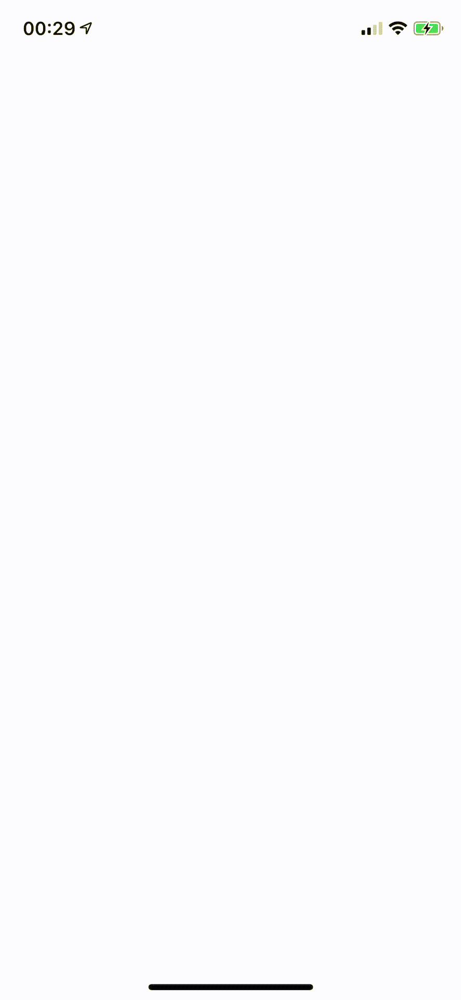
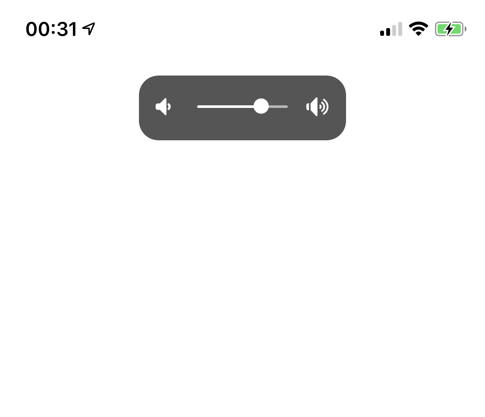
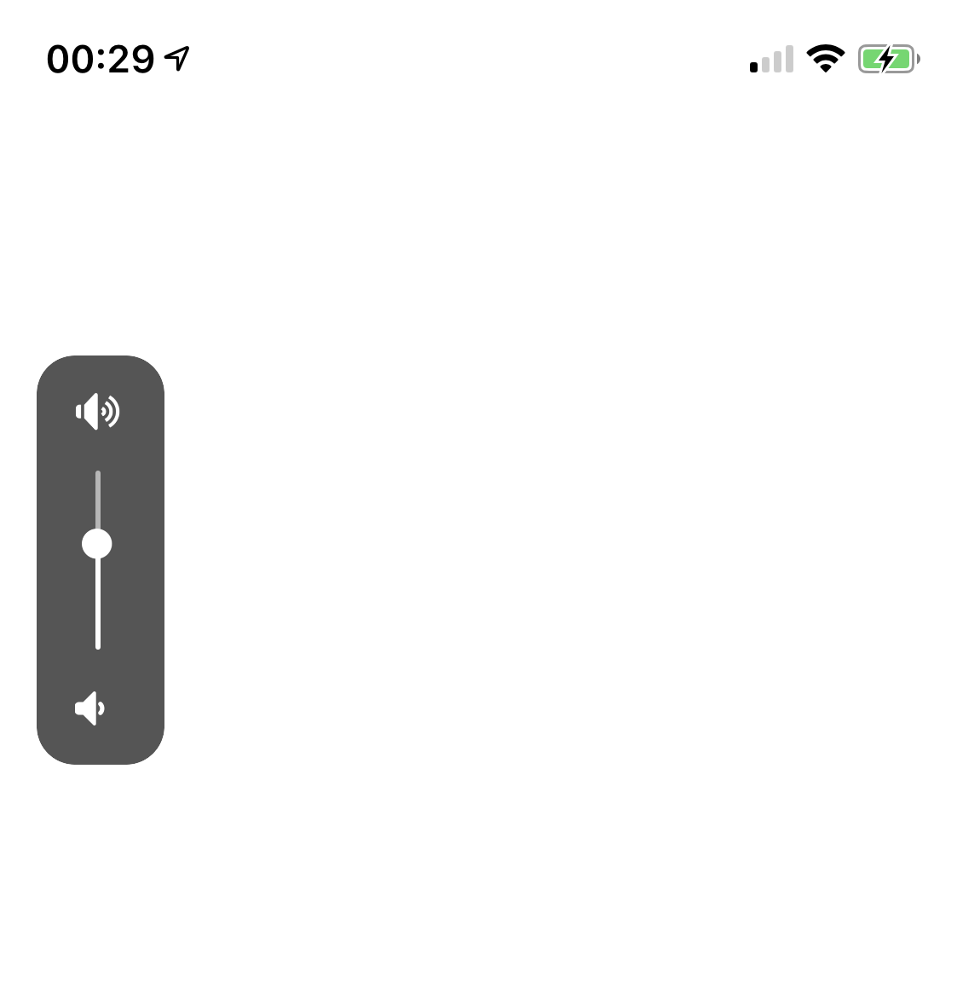

SideVolumeHUD
----
[](https://swift.org/download)
[](https://github.com/illescasDaniel/SideVolumeHUD/blob/master/LICENSE)

Nice looking volume HUD that appears right to the physical volume buttons of your device.
You can also use it in landscape style, which looks really cool too :D

(gifs might look a bit slower than the actual animations)
<p float="left">
  
  
</p>

## Features
- Multiple animations available (slideInOut, enlarge, fadeInOut)
- Haptic feedback
- Only one place and call to set it all up:
```swift
// in AppDelegate.swift, application(_, didFinishLaunchingWithOptions)
SideVolumeHUD.shared.setup(withStyle: .slideLeftRight)
```

## Screenshots
<p float="left">
  
  
</p>

### Minor TODOs:
- *Check how it looks with other devices (In iPhone X looks nice)
- Test with other frameworks that uses windows or overlays
- Maybe change from vertical to horizontal orientation dynamically (like when the user invokes the keyboard)

### License
MIT license.

Icons from:
- https://icons8.com/icon/60709/volume-up
- https://icons8.com/icon/91634/volume-down
- https://icons8.com/icon/pack/astrology/ios-glyphs

If you have [thii/FontAwesome.swift](https://github.com/thii/FontAwesome.swift) in your project, it will try to use some font awesome icons instead :)
